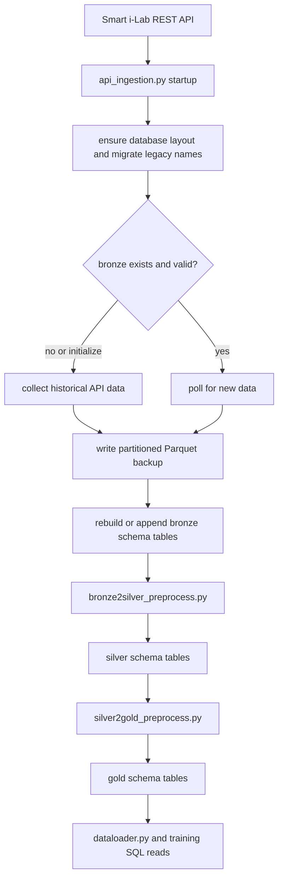

# Smart i-Lab Bronze Silver Gold Runbook

This document describes the active Python pipeline in the repository root.

The operational entry point is `api_ingestion.py`.

It now handles both modes:

1. Initialization: validate or create the bronze/silver/gold schemas, migrate legacy flat table names, backfill historical bronze data, then run bronze to silver and silver to gold.
2. Live mode: poll the API, append only new data to bronze, then refresh silver and gold only when downstream layers are missing or stale.

For now the processing model is a placeholder:

1. Bronze is the raw ingested layer.
2. Silver is produced from bronze by `bronze2silver_preprocess.py`.
3. Gold is produced from silver by `silver2gold_preprocess.py`.
4. Data content is currently equivalent across bronze, silver, and gold, but the layer separation is in place for future transformations.

## Necessary Files

Core live files:

| File | Purpose |
|---|---|
| `api_ingestion.py` | Main initialization and live ingest process |
| `CSV Training Data Code.py` | Storage layer, schema helpers, Parquet I/O, DuckDB queries |
| `bronze2silver_preprocess.py` | Bronze to silver preprocessing |
| `silver2gold_preprocess.py` | Silver to gold preprocessing |
| `dataloader.py` | Read-only query and data inspection CLI |
| `main.py` | One-shot orchestration wrapper |
| `TEST/test_live.py` | Live connectivity and ingestion monitor |
| `TEST/test_pipeline.py` | Offline test suite |
| `parquet_restructure.py` | Historical CSV or Parquet conversion utility |
| `requirements.txt` | Python dependencies for the root pipeline |

Stateful runtime paths that must persist on the server:

| Path | Purpose |
|---|---|
| `smart_ilab.duckdb` | DuckDB file holding bronze, silver, and gold schemas |
| `data/` | Hive-partitioned Parquet backup store |
| `stage/` | Temporary batch staging before bronze flush |

## Python Dependencies

Install from the root `requirements.txt`:

### Windows

```cmd
python.exe -m pip install -r requirements.txt
```

### Linux

```bash
python3 -m pip install -r requirements.txt
```

## Storage Layout

```text
smart_ilab.duckdb
  bronze.air_1
  bronze.msr_2
  bronze.smart_plug_v2
  bronze.ag_one
  bronze.zigbee2mqtt
  bronze.sensibo
  silver.air_1
  silver.msr_2
  silver.smart_plug_v2
  silver.ag_one
  silver.zigbee2mqtt
  silver.sensibo
  gold.air_1
  gold.msr_2
  gold.smart_plug_v2
  gold.ag_one
  gold.zigbee2mqtt
  gold.sensibo

data/
  air-1/year=YYYY/month=MM/day=DD/*.parquet
  msr-2/...
  smart-plug-v2/...
  ag-one/...
  zigbee2mqtt/...
  sensibo/...

stage/
  air-1/*.parquet
  msr-2/*.parquet
  smart-plug-v2/*.parquet
  ag-one/*.parquet
  zigbee2mqtt/*.parquet
  sensibo/*.parquet
```

## BSG Process Flow



## Initialization Flow

Use initialization once on a fresh server or whenever you need to rebuild the historical base.

### Windows

Initialize from all API-retained historical data:

```cmd
python.exe api_ingestion.py --all --initialize
```

Initialize from a controlled starting date instead of the API's full retained range:

```cmd
python.exe api_ingestion.py --all --history-start "2024-01-01"
```

Initialize only one device type:

```cmd
python.exe api_ingestion.py --device-type air-1 --initialize
```

### Linux

Initialize from all API-retained historical data:

```bash
python3 api_ingestion.py --all --initialize
```

Initialize from a controlled starting date:

```bash
python3 api_ingestion.py --all --history-start "2024-01-01"
```

Initialize one device type:

```bash
python3 api_ingestion.py --device-type air-1 --initialize
```

What initialization does:

1. Creates `bronze`, `silver`, and `gold` schemas if missing.
2. Migrates legacy flat table names into schema-qualified names if needed.
3. Pulls historical API data into Parquet and bronze.
4. Runs bronze to silver.
5. Runs silver to gold.

## Live Process

After initialization, run the live writer continuously.

### Windows

```cmd
python.exe api_ingestion.py --all --poll 60
```

### Linux

```bash
python3 api_ingestion.py --all --poll 60
```

This live mode does:

1. Poll the API every `N` minutes.
2. Fetch only new data after the latest bronze timestamp.
3. Append the new data into the Parquet backup store and bronze.
4. Refresh silver and gold only when their timestamps lag behind upstream layers.

## Manual Supplementary Commands

These are optional because `api_ingestion.py` already calls them when needed, but they are still useful for manual rebuilds.

### Bronze to Silver

Windows:

```cmd
python.exe bronze2silver_preprocess.py
python.exe bronze2silver_preprocess.py --device-type air-1
python.exe bronze2silver_preprocess.py --rebuild
```

Linux:

```bash
python3 bronze2silver_preprocess.py
python3 bronze2silver_preprocess.py --device-type air-1
python3 bronze2silver_preprocess.py --rebuild
```

### Silver to Gold

Windows:

```cmd
python.exe silver2gold_preprocess.py
python.exe silver2gold_preprocess.py --device-type air-1
python.exe silver2gold_preprocess.py --rebuild
```

Linux:

```bash
python3 silver2gold_preprocess.py
python3 silver2gold_preprocess.py --device-type air-1
python3 silver2gold_preprocess.py --rebuild
```

## Connection Testing and Live Validation

Use `test_live.py` to verify API connectivity, compare API and DB timestamps, and optionally perform one-shot ingest cycles.

### Windows

```cmd
python.exe TEST\test_live.py --all --check-only
python.exe TEST\test_live.py --device-type air-1 --check-only
python.exe TEST\test_live.py --all
python.exe TEST\test_live.py --all --poll 120
```

### Linux

```bash
python3 TEST/test_live.py --all --check-only
python3 TEST/test_live.py --device-type air-1 --check-only
python3 TEST/test_live.py --all
python3 TEST/test_live.py --all --poll 120
```

## Data Reads and Query Commands

Use `dataloader.py` for read-only CLI access to bronze, silver, and gold.

### Windows

```cmd
python.exe dataloader.py --summary
python.exe dataloader.py --device-type air-1 --layer bronze --latest 20
python.exe dataloader.py --device-type air-1 --layer silver --latest 20
python.exe dataloader.py --device-type air-1 --layer gold --latest 20
python.exe dataloader.py --device-type air-1 --layer bronze --since "2026-05-14 08:00"
python.exe dataloader.py --device-type air-1 --layer bronze --from "2026-05-14 08:00" --to "2026-05-14 10:00"
python.exe dataloader.py --device-type air-1 --layer bronze --latest 50 --columns timestamp,temp_s1,rh_s1,co2_s1
python.exe dataloader.py --device-type smart-plug-v2 --layer bronze --latest 50 --sensors "device_abc,device_def"
```

### Linux

```bash
python3 dataloader.py --summary
python3 dataloader.py --device-type air-1 --layer bronze --latest 20
python3 dataloader.py --device-type air-1 --layer silver --latest 20
python3 dataloader.py --device-type air-1 --layer gold --latest 20
python3 dataloader.py --device-type air-1 --layer bronze --since "2026-05-14 08:00"
python3 dataloader.py --device-type air-1 --layer bronze --from "2026-05-14 08:00" --to "2026-05-14 10:00"
python3 dataloader.py --device-type air-1 --layer bronze --latest 50 --columns timestamp,temp_s1,rh_s1,co2_s1
python3 dataloader.py --device-type smart-plug-v2 --layer bronze --latest 50 --sensors "device_abc,device_def"
```

## One-Shot Orchestrator

`main.py` is still available as a wrapper around the same building blocks.

### Windows

```cmd
python.exe main.py
python.exe main.py --device-type air-1
python.exe main.py --check-only
python.exe main.py --force-rebuild
python.exe main.py --demo
```

### Linux

```bash
python3 main.py
python3 main.py --device-type air-1
python3 main.py --check-only
python3 main.py --force-rebuild
python3 main.py --demo
```

## Historical CSV or Parquet Backfill

If you already have exported historical files and want to load them into the same bronze/parquet path, use `parquet_restructure.py`.

### Windows

```cmd
python.exe parquet_restructure.py --source "D:\exports" --dest "data" --device-type all --build-db --rebuild-db
```

### Linux

```bash
python3 parquet_restructure.py --source "/srv/exports" --dest "data" --device-type all --build-db --rebuild-db
```

## Key Command Options

### `api_ingestion.py`

| Option | Meaning |
|---|---|
| `--all` | Run all supported device types |
| `--device-type <type>` | Run one device type |
| `--initialize` | Initialize schemas, historical bronze, then silver and gold |
| `--full-history` | Bootstrap bronze from all API-retained history when empty |
| `--history-start <timestamp>` | Bootstrap bronze from a specific UTC start time when empty |
| `--lookback <hours>` | Fallback bootstrap window when no explicit history start is given |
| `--poll <minutes>` | Live polling interval |
| `--force-rebuild` | Force bronze rebuild even if timestamps look current |
| `--stage-max-rows <n>` | Flush staging buffer after `n` rows |
| `--stage-max-age-seconds <n>` | Flush staging buffer after `n` seconds |

### `bronze2silver_preprocess.py`

| Option | Meaning |
|---|---|
| `--device-type <type>` | Process one device type |
| `--rebuild` | Drop and recreate silver tables |

### `silver2gold_preprocess.py`

| Option | Meaning |
|---|---|
| `--device-type <type>` | Process one device type |
| `--rebuild` | Drop and recreate gold tables |

### `dataloader.py`

| Option | Meaning |
|---|---|
| `--summary` | Show available table counts |
| `--device-type <type>` | Select device type |
| `--layer bronze|silver|gold` | Select layer to query |
| `--latest <n>` | Fetch latest rows |
| `--since <datetime>` | Fetch rows since a timestamp |
| `--from <datetime> --to <datetime>` | Fetch a bounded time range |
| `--columns a,b,c` | Column projection |
| `--sensors a,b,c` | Filter narrow-format device IDs |

### `TEST/test_live.py`

| Option | Meaning |
|---|---|
| `--all` | Check all device types |
| `--device-type <type>` | Check one device type |
| `--check-only` | Connectivity and freshness only, no writes |
| `--poll <seconds>` | Re-run the live monitor on an interval |
| `--lookback <hours>` | Bootstrap lookback if the DB is empty |
| `--force-rebuild` | Force a live ingest rebuild cycle |

## Minimal Production Sequence

### Windows

```cmd
python.exe -m pip install -r requirements.txt
python.exe api_ingestion.py --all --initialize
python.exe api_ingestion.py --all --poll 60
```

### Linux

```bash
python3 -m pip install -r requirements.txt
python3 api_ingestion.py --all --initialize
python3 api_ingestion.py --all --poll 60
```
