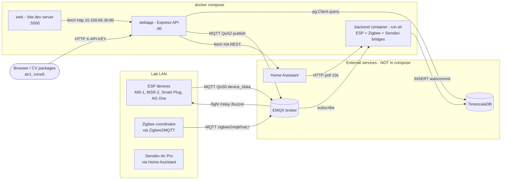

# IoT1 Folder Audit — v2

_Read-only audit. No code in `IoT1/` was modified. Last reviewed: 2026-05-11._

---

## 0. Executive summary

The `IoT1/` stack (Express REST API + Python MQTT databridge + Vite/Three.js Digital Twin)
is functional in its lab context but is **not production-ready and not safe to expose
beyond a trusted network**. It contains multiple SQL-injection paths, broken Docker
configuration that prevents the stack from starting on a clean host, and several
correctness bugs that produce silent data loss or wrong control commands.

**v2 changes vs v1:** added new findings (implicit-global race in `/groups` & `SECURITY_CHECK`,
second SQL-injection vector in `/groups` POST via `pg-format` `%s`, CDN supply-chain risk in
Digital Twin, bare-`except` masking, Zigbee unsubscribe race, deviceID path injection into
Home Assistant, missing `.dockerignore` confirmed, `.gitignore` only excludes README,
`oas_ssl_iot1.yaml` + `SSL IoT-1.yaml` present but unaudited). Bumped severity on three items.
Added CWE refs, code snippets, threat model, pipeline diagram, quick-wins, and
copy-pasteable verification commands.

### Severity counts

| Severity | Count | Examples |
|---|---|---|
| **Critical** | 6 | SQL injection in user CRUD, in Python ingest, in `/groups` POST, UTF-16 requirements.txt, Vite dev server as prod, empty compose ports |
| **High** | 13 | CORS `*`, implicit-global race, weak `access_level` validation, `pg.Client` single connection, hardcoded API IP, CDN supply chain, Sensibo HA path injection, etc. |
| **Medium** | 18 | No rate limit, no helmet, no migrations, fire-and-forget control, broken `run.sh`, no healthchecks, etc. |
| **Low** | 9 | Dead imports, typos, comment hygiene, `dockerfile` casing, etc. |

### Top-5 blockers (must fix before any deploy beyond the lab)

1. SQL injection in `index.js` user/transactions/avg routes and `/groups` POST.
2. SQL injection in `ESPDevices_to_Database.py`, `Zigbee2MQTT_to_Database.py`,
   `SensiboAirPro_to_Database.py`.
3. `Smart-iLAB-Python-Files/requirements.txt` is UTF-16 LE — `pip install` fails.
4. `compose.yaml` empty `ports: - ""` mappings + `HOST_PORT=` empty → API binds to a random
   port and is unreachable.
5. Digital Twin Dockerfile ships the Vite **dev** server as if it were production.

---

## 1. Scope

| Component | Path | Audited |
|---|---|---|
| REST API | `IoT1/SSL-IoT1-REST/index.js` (1,541 LOC) | yes — line by line for top routes |
| OpenAPI spec | `SSL-IoT1-REST/oas_ssl_iot1.yaml` (48 KB), `SSL IoT-1.yaml` (26 KB) | header only; not audited for drift vs code |
| Python databridge | `Smart-iLAB-Python-Files/{ESPDevices,Zigbee2MQTT,SensiboAirPro}_to_Database.py` | yes — all three files end-to-end |
| Digital Twin | `Smart-iLab_DigitalTwin/{package.json,src/main.js,dockerfile}` | partial — main.js head only |
| Orchestration | `IoT1/compose.yaml`, three Dockerfiles, `run.sh` | yes |
| Repo hygiene | `IoT1/.gitignore`, `IoT1/README.md` | yes |

---

## 2. Architecture & pipelines



**Coupling notes**

- All three of EMQX, Postgres, Home Assistant are **external** to the compose stack. The
  README says this is intentional ("Database and EMQX can be integrated to docker compose
  in a future repository update"), but `compose.yaml` ships with empty placeholders rather
  than `extra_hosts`/`networks` wiring → guaranteed to fail on a clean host.
- The `air1_all_zones_cv_time_features_package` and `zone5_cv_time_features_package`
  presumably hit the REST API via `/air-1/:id` and `/air-1/:id/avg`. **No `/zone-5`
  endpoint exists** — the zone5 package consumes CV-derived occupancy (its own RTSP
  pipeline in `rtsp_person_mask_tracker_new.py` at repo root) combined with air-1 sensor
  data via this REST API. The MSR-2 device exposes `zone_1_occupancy` /
  `zone_2_occupancy` / `zone_3_occupancy` columns but not zone 4/5.

---

## 3. Threat model (lightweight)

| Asset | Adversary | Path | Impact today |
|---|---|---|---|
| `users` table | Anyone with network access to API + a valid read API key | SQLi via `POST /users/:user_name` admin endpoint (requires level-0 key) | Admin-only exposes; but admin key compromise → full DB |
| `users` table | Anyone with MQTT publish access | SQLi in Python ingest L198 via crafted MQTT payload | Full DB read/write |
| Device control (lights, relays, blinds, HVAC) | Anyone with X-API-KEY (CORS=*) | Cross-origin from any site the browser visits | Physical actuation |
| Sensor history | Anyone | `time_weight` queries do not require auth at all? — they do, level [0,1,2]. Limited | Mostly read |
| API keys | Anyone | `/access/:api_key` is an oracle (admin-only but still leaks existence) | Key enumeration when admin token leaks |
| Home Assistant token | App operator | Logged in `server_Log` calls + passed in URL fetch + in compose plaintext | Token reuse for HA admin |

The CORS-`*` plus header-based auth combo is the loudest issue: an attacker who phishes
any user with an API key (extension/bookmarklet) can drive HVAC and lighting from any
malicious page.

---

## 4. Findings — REST API (`SSL-IoT1-REST/index.js`)

### 4.1 **[CRITICAL · CWE-89] SQL injection — user CRUD & transactions**

```js
// L548  POST /users/:user_name
client.query(`INSERT INTO users (user_name, api_key, access_level) VALUES ('${user_name}', '${api_key}','${access_level}')`)
// L585  GET /users/:user_name
client.query(`SELECT * FROM users WHERE user_name='${user_name}'`)
// L640  PUT /users/:user_name
client.query(`UPDATE users SET access_level = '${access_level}' WHERE user_name = '${user_name}'`)
// L679  DELETE /users/:user_name
client.query(`DELETE FROM users WHERE user_name = '${user_name}'`)
// L738  GET /transactions
client.query(`SELECT * FROM transactions WHERE (timestamp BETWEEN '${time_start}' AND '${time_end}')`)
```

These five callsites are reachable only with an admin key (`SECURITY_CHECK(... [0])`), so
the practical blast radius is "admin-key compromise → arbitrary SQL." That's still total
DB compromise. Other functions in the same file use `$1` parameters correctly
(`USER_is_available` L91, `KEY_is_available` L101) — the bug is inconsistency.

**Fix snippet**

```js
// before (L548)
client.query(`INSERT INTO users (user_name, api_key, access_level) VALUES ('${user_name}', '${api_key}','${access_level}')`, ...)
// after
client.query(
  'INSERT INTO users (user_name, api_key, access_level) VALUES ($1, $2, $3)',
  [user_name, api_key, access_level], ...
)
```

### 4.2 **[CRITICAL · CWE-89] SQL injection — `/groups` POST**

```js
// L1275, L1307, L1311
let data = {"id":`'${id}'`};
data[`${name}_ids`] = `'{${deviceIDs[nameIndex]}}'`;   // wraps array in pg literal
queryText = format('INSERT INTO groups (%s) VALUES (%s);',
                   Object.keys(data).toString(),
                   Object.values(data).toString());
```

`pg-format`'s `%s` performs **literal substitution with no escaping** — the values are
inserted into the final SQL as raw text. Combined with the upstream `'${id}'`
quoting-by-hand pattern, a query like `POST /groups?id=foo'); DROP TABLE groups;--` walks
straight into the database. Admin-only, same blast radius as 4.1.

**Fix:** parameterize values, allow-list keys, never `format('%s', userInput)`.

### 4.3 **[HIGH · CWE-89/CWE-1287] `GET_avg` accepts arbitrary column names**

`L313, L326` use `pg-format`'s `%I` for the `specData` query parameter. `%I` *does*
escape identifiers, so it's not direct injection — but **any column name in any device
table is queryable**, enabling enumeration and "is column X present?" oracle attacks.

**Fix:** allow-list per device type:

```js
const SENSOR_COLUMNS = {
  'apollo_air_1':   ['co2','temperature','humidity','pm_1_0','pm_2_5','pm_10_0','nox','voc','pressure'],
  'apollo_msr_2':   ['co2','temperature','light','uv_index','zone_1_occupancy','zone_2_occupancy','zone_3_occupancy'],
  // ...
};
if (!SENSOR_COLUMNS[deviceTable].includes(specData)) return res.status(400).json({error:'invalid sensData'});
```

### 4.4 **[HIGH · CWE-471] Implicit-global race in `/groups` POST/PUT and `SECURITY_CHECK`**

```js
// L1256-1259  (no let/const)
apollo_air_1_ids = req.query.apollo_air_1_ids;
apollo_msr_2_ids = req.query.apollo_msr_2_ids;
athom_smart_plug_v2_ids = req.query.athom_smart_plug_v2_ids;
zigbee2mqtt_ids = req.query.zigbee2mqtt_ids;
// L1345-1348 same in PUT
// L133  (no let/const) — runs on EVERY request
access_level = await RETURN_access_level(api_key);
```

Without `let/const/var`, these become **module-level globals on `globalThis`**. Two
concurrent requests share them. Request A's `await` yields → Request B overwrites
`access_level` → Request A resumes and authorises against Request B's level.
Privilege-escalation under load. Identical risk on the `/groups` parameters: concurrent
admin writes can splice each other's payloads.

**Fix:** `'use strict'` at the top of the file (this would have thrown at runtime and
made the bug obvious) and add `let` to all four assignments. Long-term, switch to
strict-by-default ESM.

### 4.5 **[HIGH · CWE-942] CORS wildcard with auth**

```js
// L23
app.use(cors({origin: '*'}))
```

Combined with header-based auth and browsers happily sending the `X-API-KEY` if scripted
to, any page can drive the API on behalf of any logged-in user. Restrict to the Digital
Twin origin from env: `cors({origin: process.env.ALLOWED_ORIGINS?.split(',') ?? []})`.

### 4.6 **[HIGH · CWE-20] `access_level` validation is a regex truthiness test**

```js
// L632
if(/\d/.test(access_level)){ /* do nothing */ }else{ return 400 }
```

Passes `"5abc"`, `"99"`, `"-0xfffabc"`. Fix:
```js
const lvl = Number(access_level);
if (!Number.isInteger(lvl) || lvl < 0 || lvl > 2) return res.status(400).json({error:'access_level must be 0|1|2'});
```

### 4.7 **[HIGH · CWE-918/CWE-22] Sensibo `deviceID` flows unencoded into Home Assistant URL**

```js
// L1179
await fetch(`${process.env.HOME_ASSISTANT_URL}:${process.env.HOME_ASSISTANT_PORT}/api/services/climate/set_hvac_mode`,
  {method:'POST', body: JSON.stringify({entity_id: deviceID, hvac_mode: hvacMode}), headers:{...}})
```

`deviceID` is `req.params.id`. The body is JSON-encoded so the body is safe, but the
unrelated GET endpoint in `SensiboAirPro_to_Database.py` L33 does
`f"http://{HA_IP}:{HA_PORT}/api/states/{deviceID}"` — `deviceID` interpolated into the
URL path. A device id like `foo/../config` reaches a different HA endpoint. The DB
constrains valid IDs but never re-validates after a row is created. Encode via
`encodeURIComponent` and validate against a strict regex.

Also: `await fetch(...)` on L1179/L1188 **does not check `response.ok`** — HA returns
4xx → REST API returns 200. Silent control failures.

### 4.8 **[HIGH · CWE-400] Single global `pg.Client`, no pool, no auto-reconnect**

```js
// L35-43
const client = new Client({ host, user, port, password, database })
client.connect();
```

`pg.Client` is single-connection. One slow query blocks every request. A dropped DB
connection takes down all subsequent requests until the container is restarted (`Client`
does not auto-reconnect; only `Pool` does). Switch to `Pool` and let `acquire/release`
handle reconnection.

### 4.9 **[MEDIUM] Mixed callback + async patterns leak responses**

Throughout the file: `client.query(text, (err, data) => { ... })` inside `async`
handlers. The outer handler returns immediately after kicking off the callback. If the
DB throws after `res.status(200).send()` was scheduled but before it flushed, the next
write to `res` from the catch block crashes the handler (`Cannot set headers after sent`).
Standardize on `await client.query(...)`.

### 4.10 **[MEDIUM · CWE-770] No rate limit, no timeout, no body-size cap, no helmet**

- `/access/:api_key` is an admin-only existence oracle (L463 `KEY_is_available`).
- `express.json()` accepts up to 100 KB by default — bursts of small POSTs can wedge the
  single-connection `pg.Client`.
- No `app.use(helmet())` → missing X-Frame-Options, X-Content-Type-Options, HSTS, CSP.
- No timeout middleware → slowloris keeps the lone DB connection open.

### 4.11 **[MEDIUM · CWE-778] Audit log blind spot**

```js
// L174
if(await RETURN_user_name(api_key)==="Digital_Twin"){ return; }
```

`UPDATE_transactions` short-circuits for the Digital Twin user. The DT is the busiest
client; suppressing it means a stolen DT key has zero footprint in `transactions`.
Either log to a separate high-volume table or sample 1-in-N — but do not skip.

### 4.12 **[MEDIUM] `RETURN_access_level` returns `-1` on error**

```js
// L114-116
}catch(err){ ... return -1; }
```

`SECURITY_CHECK` then tests `array.includes(access_level)`. If `[0]` is the required
level, `-1` is not in the array → correctly denied. But the global `access_level = -1`
(see 4.4) then leaks into the next request that doesn't go through `SECURITY_CHECK`'s
re-assignment path. Belt-and-braces: throw, don't return sentinel.

### 4.13 **[MEDIUM] `MQTT_RECONNECT_PERMISSION` typo**

```js
// L56
reconnectPeriod: process.env.MQTT_RECONNECT_PERMISSION,
// compose.yaml L19 declares MQTT_RECONNECT_PERIOD
```

Resolves to `undefined`, mqtt.js falls back to the 1000ms default. Reconnect works *by
accident*. Fix the typo so the config is actually wired.

### 4.14 **[MEDIUM] `.replace` not `.replaceAll` in publish topics**

```js
// L423
mqttclient.publish(`${deviceName.toLowerCase().replace("-","_").replace(" ","_")}_${deviceID}/light`, ...)
```

`.replace("-","_")` replaces only the first dash. No device name today has multiple
dashes, but firmware naming changes ("Apollo MSR-2-v2") will cause silent topic mismatch.

### 4.15 **[MEDIUM] `POST_light` numeric validation accepts non-numbers**

```js
// L390 (red), L398 (green), L406 (blue), L414 (brightness)
if(lightRed < 0 || lightRed > 1){ return 400 }
```

`"abc" < 0` is false, `"abc" > 1` is false → string passes. Use
`Number.isFinite(+v) && +v >= 0 && +v <= 1`.

### 4.16 **[MEDIUM] MSR-2 buzzer endpoint typo crashes its own 400 path**

```js
// L828, L830
return res.status(400).json({error: `... for Apollo MSR-2 with ID: ${device_id}`});
//                                                                       ^^^^^^^^^ undefined
```

Variable is `deviceID`. ReferenceError → caught upstream → returns 500 instead of 400.

### 4.17 **[LOW] Dead/wrong imports and stale comments**

```js
// L13   const _ = require("lodash");                  // not used
// L15   const { v4: uuidv4, parse} = require("uuid"); // parse not used
// L32   var format = require('pg-format');            // `var`, should be const
// L33   const {Result} = require("lodash");           // lodash has no `Result` export — silently undefined
// L546-547  commented-out SQL with real-looking values left in source
```

### 4.18 **[LOW] `app.listen(process.env.HOST_PORT, ...)`** (L1541)

`HOST_PORT` is empty in `compose.yaml` → Node treats `undefined` as port 0 (random).
Combined with empty `ports: - ""` mapping, the API is **unreachable** in the shipped
config. Set a default: `app.listen(process.env.HOST_PORT || 3000, '0.0.0.0', ...)`.

### 4.19 **[LOW] Generic 500 leaks PG errors into logs**

Many handlers do `server_Log(\`...\n${err}\`)` where `err` is a raw PG error including
schema fragments. Sanitize before logging in prod.

---

## 5. Findings — Python databridge (`Smart-iLAB-Python-Files/*`)

### 5.1 **[CRITICAL · CWE-89] SQL injection from MQTT payload — `ESPDevices_to_Database.py` L198, L211, L215**

```python
# L198 — main insert
cur.execute(f"INSERT INTO {table_name} ({str(columns).replace(...)}) VALUES ({str(values).replace(...)})")
# L211, L215 — error_logs fallback (also injectable)
cur.execute(f"INSERT INTO error_logs ({table_name}) VALUES ('{str(msg.payload.decode('utf-8'))}')")
```

`table_name` is derived from `msg.topic` — anyone with MQTT publish access (the broker
auth-list, and EMQX is on the lab LAN with no TLS) can craft a topic that injects SQL.
Same pattern in `Zigbee2MQTT_to_Database.py` L196, L209 and
`SensiboAirPro_to_Database.py` L49, L57.

**Fix (sketch):**

```python
from psycopg2 import sql
ALLOWED = {'apollo_air_1', 'apollo_msr_2', 'athom_smart_plug_v2', 'airgradient_one'}
prefix = '_'.join(table_name.split('_')[:3])
if prefix not in ALLOWED: return
cur.execute(
    sql.SQL("INSERT INTO {} ({}) VALUES ({})").format(
        sql.Identifier(table_name),
        sql.SQL(',').join(map(sql.Identifier, columns)),
        sql.SQL(',').join(sql.Placeholder() * len(values))
    ),
    values,
)
```

### 5.2 **[HIGH] TimescaleDB hypertables are never created**

`grep -r "create_hypertable" IoT1/` returns zero matches. README explicitly says
"{device-name-separated-by-underscores}_{id} **hypertable** for each existing device" but
the Python code only does `CREATE TABLE IF NOT EXISTS`. The REST API's
`time_weight('Linear', timestamp, %I)` query (L313, L326) requires the
`timescaledb_toolkit` extension but tolerates plain tables — it just degrades to a full
sequential scan as data grows. README "limitation": "TimescaleDB buckets not fully
utilized." Confirmed.

At 0.1 Hz (per README) × 5 device types × ~5 device instances ≈ 13M rows/year/table
without chunking. air1/zone5 CV queries against `/avg` will see linearly growing latency.

**Fix:** after `CREATE TABLE`, call
`cur.execute(f"SELECT create_hypertable('{tbl}', 'timestamp', if_not_exists => TRUE);")`
inside an allow-list.

### 5.3 **[HIGH] DB connection at module import — no retry**

```python
# ESPDevices L39, Zigbee2MQTT L37, Sensibo L20
conn = psycopg2.connect(host=..., dbname=..., ...)
```

If Postgres is unreachable at startup, the process exits before `if __name__ == '__main__'`.
Combined with `run.sh` (see 6.5), one bridge's failure takes the container down with no
restart policy in compose (see 6.11). Wrap in a retry loop (`tenacity` or hand-rolled).

### 5.4 **[HIGH] Shared MQTT `CLIENT_ID = 'Subscriber1'`** in `ESPDevices_to_Database.py` L25

Two parallel instances (rolling deploy, accidental duplicate, sibling container) will
flap forever as the broker disconnects the older one. Append
`os.getenv('HOSTNAME', uuid.uuid4().hex)`.

`Zigbee2MQTT_to_Database.py` uses `'Zigbee2MQTT to Database Code'` — same issue, just
different literal. Note the space in the client id is non-standard for MQTT; some
brokers reject it.

### 5.5 **[HIGH] Device discovery only at connect time**

```python
# ESPDevices L43-148 on_connect, only runs once
for i in TOPIC: cur.execute(f"SELECT id FROM {i};") ...
```

New devices added after the subscriber connected are **never subscribed to** until
restart. No periodic refresh, no `+` wildcard, no notify trigger. Same in Zigbee
(`on_connect` L68-126). Sensibo doesn't subscribe at all — it polls a fixed
`deviceIDs` list captured at startup (L65-70). All three need a refresh path.

### 5.6 **[HIGH · CWE-1188] No payload schema validation → silent ingest failures**

If firmware adds a new field, the INSERT fails (column doesn't exist). Exception falls
into the bare-`except` at L205. The fallback at L211 inserts into `error_logs` using yet
another raw f-string. If `error_logs` doesn't have a column matching `table_name`, L215
attempts an `ALTER error_logs ADD COLUMN {table_name} text` — itself injectable. Worse,
**the data point is lost** silently with only a `print()` to stdout (L224).

### 5.7 **[MEDIUM] Zigbee unsubscribe/resubscribe race**

```python
# Zigbee2MQTT_to_Database L136-199
client.unsubscribe(msg.topic)
# ... do DB work ...
client.subscribe(msg.topic)
```

paho-mqtt's `unsubscribe`/`subscribe` are asynchronous. Between the call return and the
broker's ack, messages on that topic are still being delivered. The "guard" doesn't
actually guard. Also, an exception in the DB section means the topic is left
unsubscribed permanently → silent loss for that device until reconnect.

### 5.8 **[MEDIUM] Bare `except:` masks SystemExit/KeyboardInterrupt**

`ESPDevices L205`, `Zigbee2MQTT L206`, `Sensibo L55`. Replace with `except Exception:`.

### 5.9 **[MEDIUM] Sensibo bridge has known crash on connection error**

The README explicitly says "Sensibo Air Pro Databridge encounters an error when a
connection error occurs." Confirmed in source: `getAndInsertSensiboAirProData` (L32)
catches the request error in `except:` and writes to `error_logs` — but
`database_table_name` is a local in the try block (L37); if the exception fires before
L37, `database_table_name` is undefined inside the except → `NameError` → unhandled.
Container exits.

### 5.10 **[MEDIUM] `on_disconnect` writes to the DB on disconnect**

`ESPDevices L155` `cur.execute("INSERT INTO error_logs (server) VALUES (...)")` runs
inside the disconnect handler with a connection that may itself be broken. Throws inside
the handler → paho retries indefinitely without logging the actual cause.

### 5.11 **[MEDIUM] Three subscribers, one DB connection each, no pooling, autocommit-per-row**

`psycopg2` `autocommit=True` + insert-per-message = one round-trip per data point per
device. At 0.1 Hz current rate this is fine; if the lab scales devices, batch with
`execute_values` or accept Kafka/Redpanda in front.

### 5.12 **[LOW] `requirements.txt` deps are old**

Re-saved as UTF-8 (see 6.1), then:

- `urllib3 2.3.0` has CVE-2024-37891 (fix in 2.4.0) and CVE-2025-50181 (fix in 2.5.0).
- `requests 2.32.3` is current.
- `paho-mqtt 1.6.1` is two majors behind (2.x available).
- `psycopg2-binary 2.9.10` is fine on glibc but breaks on alpine (see 6.4).

---

## 6. Findings — Docker / Compose

### 6.1 **[CRITICAL] `requirements.txt` is UTF-16 LE**

The file starts with `0xFF 0xFE` BOM (`Read` output renders as `��c e r t i f i ...`).
`pip` does not auto-detect UTF-16 — `pip install -r requirements.txt` fails on a clean
build with `UnicodeDecodeError`. Re-save as UTF-8 without BOM.

```powershell
(Get-Content .\Smart-iLAB-Python-Files\requirements.txt -Encoding Unicode) `
  | Set-Content -Encoding utf8 .\Smart-iLAB-Python-Files\requirements.txt
```

### 6.2 **[CRITICAL] `compose.yaml` `ports: - ""`**

Both `webapp` and `web` services have empty port mappings. `docker compose` parses these
as empty strings and silently skips the publish. Combined with `HOST_PORT=` empty in env
→ Node binds to a random port → the stack is unreachable. Fix:

```yaml
webapp:
  environment:
    - HOST_PORT=3000
  ports: ["80:3000"]
web:
  ports: ["5500:5500"]
```

### 6.3 **[CRITICAL · CWE-1188] Digital Twin ships Vite dev server as production**

`Smart-iLab_DigitalTwin/dockerfile`:

```dockerfile
RUN npm install -g vite
CMD ["npm","run","dev"]   # → "vite --host --port 5500"
```

The dev server has source maps, HMR websockets exposed, no minification, weaker security
defaults, and node_modules permissions. (`package.json` script uses `vite --host`, so it
does listen on all interfaces.) Switch to multi-stage:

```dockerfile
FROM node:22-alpine AS build
WORKDIR /app
COPY package*.json ./
RUN npm ci
COPY . .
RUN npm run build

FROM nginx:1.27-alpine
COPY --from=build /app/dist /usr/share/nginx/html
EXPOSE 80
```

### 6.4 **[HIGH] `python:3.12.3-alpine` + `psycopg2-binary` musl mismatch**

`psycopg2-binary` ships glibc-linked wheels. On Alpine (musl), pip falls back to building
from source, which needs `gcc musl-dev postgresql-dev` — not installed in the Dockerfile.
Image build silently produces a broken or sdist-compiled binary. Use `python:3.12-slim`
(Debian glibc) or add `apk add --virtual .build gcc musl-dev postgresql-dev`.

### 6.5 **[HIGH] `run.sh` process management is broken**

```sh
exec python3 ESPDevices_to_Database.py &
exec python3 SensiboAirPro_to_Database.py &
exec python3 Zigbee2MQTT_to_Database.py & wait
```

`exec` replaces the current shell. Combined with `&` (background) the semantics are
undefined-ish — in practice only one `exec` matters and the others are spawned. Shebang
`#!/bin/bash` but Alpine has no bash; `CMD ["sh","./run.sh"]` runs via dash/ash. If any
script crashes, only `wait` returns — the container stays "running" with one or two dead
subscribers.

**Fix:** one process per container. Split `backend` into three compose services
(`databridge-esp`, `databridge-zigbee`, `databridge-sensibo`) sharing the same image,
each with `CMD ["python","-u","ESPDevices_to_Database.py"]` etc. Or use `supervisord`.

### 6.6 **[HIGH] All Dockerfiles run as root**

No `USER node`/`USER 1000` directive in any of the three Dockerfiles. Add a non-root
user. For the REST API switching to a high port (3000) avoids needing root for the bind.

### 6.7 **[HIGH] Floating tags, EOL base images, no digest pinning**

- `Smart-iLab_DigitalTwin/dockerfile` uses `node:alpine` (no major version) — drifts.
- `SSL-IoT1-REST/dockerfile` uses `node:18-alpine` — **Node 18 went EOL April 2025**.
- Bump to `node:22-alpine@sha256:<digest>` and pin.

### 6.8 **[HIGH] `npm install` instead of `npm ci` in both Node Dockerfiles**

Non-reproducible builds. Use `npm ci` so the lockfile is authoritative.

### 6.9 **[HIGH] No `.dockerignore` anywhere**

Confirmed: no `.dockerignore` in any of the three build contexts. `COPY . .` copies
`.git/`, `node_modules/`, `__pycache__/`, any local `.env`, into the image. Bakes secrets
into the build layer cache, bloats the image, and leaks files. Add per-context.

### 6.10 **[HIGH] `.gitignore` only excludes `README.md`**

Contents of `IoT1/.gitignore`:

```
README.md
```

`.env`, `node_modules/`, `__pycache__/`, lockfile-resolved artifacts — none excluded.
README is unusual to gitignore; this is almost certainly a placeholder. Replace with a
normal Node + Python `.gitignore`.

### 6.11 **[MEDIUM] No `restart`, `depends_on`, `healthcheck`, `env_file`, networks, volumes**

`compose.yaml` is bare-bones. Add `restart: unless-stopped`, `env_file: .env`, a network,
and healthchecks (REST: `curl /access/x` returning 401; subscribers: `pgrep python`).

### 6.12 **[MEDIUM] Compose declares no Postgres / EMQX / Home Assistant**

The three apps reach out to external infra. The README acknowledges this is intentional
("can be integrated to docker compose in a future repository update") but the env
placeholders make `docker compose up` produce three crashing containers on a clean host.
Either ship a dev-mode `docker-compose.dev.yaml` with timescaledb/EMQX, or document the
prerequisite with `extra_hosts`/`network_mode: host` examples.

### 6.13 **[LOW] `EXPOSE 80` requires root** — switch REST to a high port.

### 6.14 **[LOW] Dockerfile filenames are lowercase** — works on Linux, fragile in
case-sensitive CI tooling. Rename to `Dockerfile`.

---

## 7. Findings — Digital Twin

### 7.1 **[HIGH · CWE-829] Three.js & extensions loaded from `cdn.jsdelivr.net` without SRI**

```js
// src/main.js L14-30
import * as THREE from 'https://cdn.jsdelivr.net/npm/three@0.172.0/build/three.module.js';
import { OrbitControls } from "https://cdn.jsdelivr.net/npm/three@0.172.0/examples/jsm/controls/OrbitControls.js";
// ...8 more from the same CDN
```

`three`, `chart.js`, `gsap` are also declared in `package.json` `dependencies` but the
CDN-fetched copies are what actually run. **No Subresource Integrity (SRI) hashes**, so a
CDN compromise or DNS hijack pushes arbitrary JS into every Digital Twin session. With
the REST API's CORS=`*` and the user's API key cached in the browser, that's full
device-control compromise from a single point.

**Fix:** drop the CDN imports, use the bundled deps from `package.json`, build via
`npm run build`, serve static.

### 7.2 **[HIGH] Hardcoded REST API IP**

```js
// src/main.js L5
const ip = "http://10.158.66.30:80";
```

Only works on the lab LAN. In the compose stack the DT cannot reach the REST API at all
(no compose-network DNS — it doesn't use `http://webapp:80`). Pass via Vite env
(`import.meta.env.VITE_API_URL`), inject at build time.

### 7.3 **[MEDIUM] No CSP, no auth flow visible in `main.js`**

The first 120 lines of `main.js` show no API-key handling — key acquisition must happen
later or via UI elsewhere. Without CSP, the CDN imports above also bypass any content
security controls.

---

## 8. Cross-cutting issues

### 8.1 **[HIGH] No schema/migrations layer**

Tables are created ad-hoc by Python subscribers via inline `CREATE TABLE IF NOT EXISTS`.
REST API and CV packages assume the schema. Any change requires manually-coordinated
edits across at least three repos. Introduce `alembic` or `sqitch`; check it in.

### 8.2 **[HIGH] No ingest idempotency**

Per-device tables have no primary key on `timestamp`. A broker redelivery, subscriber
reconnect replay, or duplicate publisher → duplicate rows. `time_weight` queries in
air1/zone5 will double-count. Add `PRIMARY KEY (timestamp)` and `ON CONFLICT DO NOTHING`.

### 8.3 **[MEDIUM] No backpressure**

Broker → INSERT direct path. Burst spikes hit the DB hard. Add a bounded queue (asyncio
queue, Redis stream, or batch every N msg / T ms in the subscriber).

### 8.4 **[MEDIUM] Auth queries uncached**

Every request: `KEY_is_available` → `RETURN_access_level` → often `RETURN_user_name` in
`UPDATE_transactions`. Three `SELECT * FROM users WHERE api_key=$1` per request. Cache
in-memory (5-min TTL) keyed on api_key.

### 8.5 **[MEDIUM] No TLS anywhere**

MQTT plaintext, REST API HTTP, HA HTTP. Compose declares no reverse proxy. Add Caddy or
nginx with TLS termination; require `mqtts://` for EMQX.

### 8.6 **[LOW] OpenAPI spec drift unverified**

`oas_ssl_iot1.yaml` and `SSL IoT-1.yaml` exist but weren't audited against the code in
this pass. Likely drifted given the inline route-handler edits. Run an OAS contract test.

---

## 9. Pipeline-specific summary

### Pipeline 1 — Sensor ingest

`ESP/Zigbee → MQTT → Python subscriber → Postgres`

Top issues: §5.1 (SQLi), §5.2 (no hypertables), §5.5 (no device refresh), §5.6 (no
schema validation), §5.7 (Zigbee unsubscribe race), §8.2 (no idempotency).

### Pipeline 2 — Read path

`Browser/CV → REST → Postgres`

Top issues: §4.1/4.3 (SQLi/identifier oracle), §4.8 (single pg.Client), §5.2 (full-scan
queries), §8.4 (uncached auth).

### Pipeline 3 — Control path

`Browser → REST → MQTT → device` and `Browser → REST → HA REST`

Top issues: §4.5 (CORS+key), §4.7 (HA URL injection), §4.13/4.14/4.15 (validation
typos), §4.16 (MSR-2 buzzer crash), fire-and-forget with no state confirmation.

### Pipeline 4 — Compose orchestration

Top issues: §6.1/6.2/6.3 (build blockers), §6.5 (run.sh), §6.10 (.gitignore),
§6.12 (missing infra).

---

## 10. Remediation plan (priority order)

| # | Item | Effort | Impact |
|---|---|---|---|
| 1 | Fix the 6 CRITICAL items (5 SQLi vectors + UTF-16 requirements + Vite-dev-as-prod + empty ports) | M | unblocks deploy |
| 2 | Lock down CORS, add helmet, rate-limit `/access` and `/users` | S | high |
| 3 | Add `'use strict'` to `index.js`; fix all implicit globals (`access_level` L133; `apollo_air_1_ids` etc. L1256+/L1345+) | XS | high |
| 4 | Swap `pg.Client` → `pg.Pool`; await all queries | S | high |
| 5 | Add `.dockerignore`, fix `.gitignore`, multi-stage Node builds, non-root USER, pinned digests | S | high |
| 6 | Convert per-device tables to TimescaleDB hypertables; add a migrations layer (`sqitch` or `alembic`) | M | medium-high |
| 7 | Split `backend` into 3 compose services; add restart/healthchecks/env_file | S | medium |
| 8 | Parameterize Digital Twin API URL; drop CDN imports or add SRI | S | medium-high |
| 9 | Encode `deviceID` into HA URL; check `fetch` `response.ok` | XS | medium |
| 10 | Validate `access_level` strictly; numeric validation in `POST_light`; fix `MQTT_RECONNECT_PERMISSION` typo; fix `device_id` typo (L828/L830) | XS | medium |
| 11 | Add PRIMARY KEY (timestamp) + `ON CONFLICT DO NOTHING` per device table | S | medium |
| 12 | Stop excluding Digital_Twin from `transactions` (or sample) | XS | medium |
| 13 | Add tests, CI, `npm audit`, `pip-audit`, OpenAPI contract test | M | medium |
| 14 | TLS at the edge (Caddy/nginx) + MQTT TLS | M | medium |

---

## 11. Quick wins (under 30 minutes each)

1. Add `'use strict';` at the top of `index.js`. Run it once — it will throw on the
   implicit globals (§4.4) and tell you exactly which lines to fix.
2. Fix `MQTT_RECONNECT_PERMISSION` → `MQTT_RECONNECT_PERIOD` (L56).
3. Fix `device_id` → `deviceID` typos at L828, L830.
4. Replace `cors({origin: '*'})` with `cors({origin: process.env.ALLOWED_ORIGINS?.split(',') ?? false})`.
5. Re-save `requirements.txt` as UTF-8.
6. Fill in `compose.yaml` `ports` and `HOST_PORT`.
7. Add `.env*` and `node_modules/` and `__pycache__/` to `.gitignore`. Remove `README.md` from it.
8. Switch `npm install` → `npm ci` in both Node Dockerfiles.

---

## 12. Verification (after fixes)

Sanity:
```powershell
# Image builds succeed end-to-end
docker compose build

# Stack comes up
docker compose up -d
docker compose ps  # all three healthy

# REST API reachable
curl -i http://localhost/access/somekey -H "X-API-KEY: $env:ADMIN_KEY"

# Digital Twin loads, console clean of CDN-failure errors
Start-Process http://localhost:5500
```

SQL-injection regression tests:
```powershell
$h = @{'X-API-KEY' = $env:ADMIN_KEY}

# 4.1 — POST /users
Invoke-WebRequest -Method POST -Headers $h `
  -Uri "http://localhost/users/bob'); DROP TABLE users;--?access_level=1"
# Expect: 400 invalid username
# Verify: psql -c "SELECT 1 FROM users LIMIT 1"   # still works

# 4.2 — POST /groups
Invoke-WebRequest -Method POST -Headers $h `
  -Uri "http://localhost/groups?id=foo'); DROP TABLE groups;--"
# Expect: 400 invalid id

# 4.3 — GET /air-1/:id/avg with sensData not in allow-list
Invoke-WebRequest -Headers $h `
  -Uri "http://localhost/air-1/01/avg?sensData=api_key"
# Expect: 400 invalid sensData
```

Auth/CORS:
```powershell
# 4.5 — CORS rejected from disallowed origin
curl -i -H "Origin: http://evil.example" http://localhost/air-1
# Expect: no Access-Control-Allow-Origin header

# 4.6 — access_level=5abc
Invoke-WebRequest -Method PUT -Headers $h `
  -Uri "http://localhost/users/alice?access_level=5abc"
# Expect: 400
```

CV consumers:
```powershell
# air1 / zone5 packages still consume the API after fixes
python -c "import json,urllib.request; r=urllib.request.urlopen('http://localhost/air-1'); print(json.load(r))"
# Expect: ['01','02', ...]
```

Supply chain:
```powershell
cd .\IoT1\SSL-IoT1-REST; npm audit --production
cd ..\Smart-iLAB-Python-Files; pip-audit -r requirements.txt
# Expect: no HIGH/CRITICAL
```

---

## 13. Out-of-scope notes

- `oas_ssl_iot1.yaml` (48 KB) and `SSL IoT-1.yaml` (26 KB) exist but were not audited for
  drift against the code. Likely stale given the breadth of inline route handlers.
- I did not run the stack; all findings are static (read-only) analysis.
- The `air1_all_zones_cv_time_features_package`, `zone5_cv_time_features_package`, and
  `zone1_end_to_end_program_package` directories at the repo root are CV consumers of
  this API. Their compatibility with the proposed fixes should be re-verified after each
  remediation step — particularly the `sensData` allow-list (§4.3) and any column
  rename that comes out of the migrations work (§8.1).
- `.git/` exists inside `IoT1/` (separate from the parent CARE-SSL working tree). Audit
  results assume the snapshot at HEAD of that inner repo.
