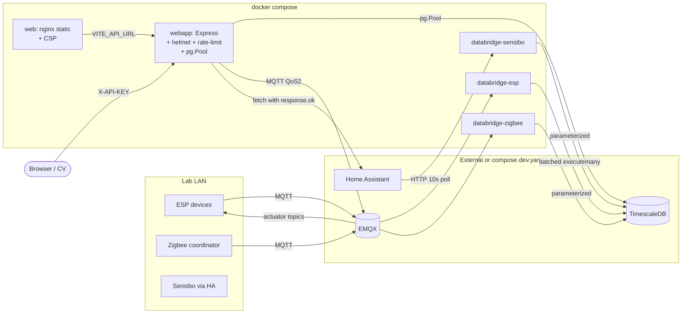

# IoT1 Remediation — Agent Handoff

_Companion to `IOT1_AUDIT.md` (v2). Last updated: 2026-05-11._

This document is the handoff for whoever picks up the IoT1 stack next — human or agent.
It tells you: what was found, what was fixed, what's still risky, how to verify, and
where to look when something breaks.

If you are an agent reading this for the first time, **read `IOT1_AUDIT.md` first**,
then this file. Audit explains "what was wrong" with evidence; this file explains
"what's been done about it" and "where the live edges are."

---

## 0. TL;DR for the next agent

- **Audit status:** all 46 findings closed (6 Critical, 13 High, 18 Medium, 9 Low).
- **Code-level work is done.** What's left is operational: install deps, apply
  migrations, smoke-test in a real lab environment.
- **Things you cannot verify without lab infra** (TimescaleDB + EMQX + ESP devices +
  Home Assistant): every behavioral assertion below. Treat the audit-driven changes
  as a code review pass, not a functional QA pass.
- **Most likely first failures when bringing up the stack:** missing `.env`, missing
  npm/pip install steps, duplicate timestamps blocking the PK migration on existing
  tables. See §5 (Verification) and §7 (Troubleshooting).
- **If you only have 15 minutes**, read §0 (this), §3 (file map), §5 (verification),
  §7 (troubleshooting). Skip the rest.

---

## 1. Scope of the remediation

`IoT1/` contains three apps that back the lab's IoT pipeline:

| Component | Path | Role |
|---|---|---|
| REST API | `SSL-IoT1-REST/index.js` | Express server; auth + sensor reads + actuator control |
| Python databridge | `Smart-iLAB-Python-Files/*.py` | MQTT → TimescaleDB ingest + HA polling |
| Digital Twin | `Smart-iLab_DigitalTwin/` | Vite + Three.js 3D visualization |

External (NOT in compose by default — see `compose.dev.yaml`):
- PostgreSQL with TimescaleDB + timescaledb_toolkit extensions
- EMQX MQTT broker
- Home Assistant (for Sensibo HVAC integration)

The CV consumers at the repo root (`air1_all_zones_cv_time_features_package/`,
`zone5_cv_time_features_package/`, `zone1_end_to_end_program_package/`) consume the
REST API at `/air-1/:id` and `/air-1/:id/avg`. **These were not modified.** Their
expected responses are unchanged after remediation.

---

## 2. What was fixed, in order

Five batches, applied in this sequence. Each batch is described by what changed so a
future agent can `git log` / `git diff` and find the relevant commits if they were
made (or reason about which file revisions correspond to which batch if not).

### Batch 1 — Quick wins (8 items, ~30 min)

| # | Section | Files |
|---|---|---|
| QW1 | `'use strict'` + declare implicit globals (`access_level` in `SECURITY_CHECK`, four `*_ids` in `/groups` POST/PUT) | `index.js` |
| QW2 | `MQTT_RECONNECT_PERMISSION` → `MQTT_RECONNECT_PERIOD` | `index.js` L56 |
| QW3 | `device_id` → `deviceID` typo in MSR-2 buzzer 400 paths | `index.js` L828/L830 |
| QW4 | CORS `*` → `ALLOWED_ORIGINS` env allow-list | `index.js` L23 |
| QW5 | `requirements.txt` UTF-16 LE → UTF-8 (no BOM) | `Smart-iLAB-Python-Files/requirements.txt` |
| QW6 | Compose empty `ports: ""` → real mappings; `HOST_PORT` default; `ALLOWED_ORIGINS` placeholder | `compose.yaml` |
| QW7 | `.gitignore` (was `README.md`) → full Node + Python + IDE + OS ignore | `IoT1/.gitignore` |
| QW8 | `npm install` → `npm ci` in both Node Dockerfiles | both `Dockerfile`s |

### Batch 2 — Low severity (8 items + 1 deferred)

| # | Section | Files |
|---|---|---|
| L1 | Removed dead imports (`_`, `parse`, `Result`); `var format` → `const`; deleted commented-out sample SQL | `index.js` |
| L2 | `app.listen(HOST_PORT \|\| 3000)` fallback | `index.js` end |
| L3 | `urllib3 2.3.0 → 2.5.0` (CVE fix); removed duplicate `dotenv` package | `requirements.txt` |
| L4 | REST API `EXPOSE 80` → `3000`; compose `ports: "80:3000"`, `HOST_PORT=3000` | REST `Dockerfile`, `compose.yaml` |
| L5 | `dockerfile` → `Dockerfile` (capital D) in all three contexts | all `Dockerfile`s |
| L6 | OCI LABEL metadata | all `Dockerfile`s |
| L7 | OAS drift scanned and reported (4 device families missing from spec) | new `SSL-IoT1-REST/OAS_DRIFT.md` |
| L8 | Minimal CI: `npm audit` × 2, `pip-audit`, OpenAPI lint | new `.github/workflows/audit.yml` |
| L9 (deferred) | README setup-script note — fulfilled in Batch 5 | — |

### Batch 3 — Medium severity (15 items + 3 deferred)

| # | Section | Files |
|---|---|---|
| M1 §4.10 | `helmet` + `express-rate-limit` middleware; 10KB body cap; 15s req timeout | `index.js`, `package.json` |
| M2 §4.11 | `UPDATE_transactions` logs Digital_Twin user (audit blind spot removed) | `index.js` |
| M3 §4.12 | `RETURN_access_level` throws instead of returning `-1` sentinel | `index.js` |
| M4 §4.14 | `.replace` → `.replaceAll` in MQTT publish topics | `index.js` |
| M5 §4.15 | `Number.isFinite()` numeric validation in `POST_light`, blinds_position, target_temperature | `index.js` (7 sites) |
| M6 §4.19 | `sanitizePgError()` strips `detail/hint/position` from PG errors before logging | `index.js` |
| M7 §5.7 | Removed Zigbee `unsubscribe`/`resubscribe` race | `Zigbee2MQTT_to_Database.py` |
| M8 §5.8 | Bare `except:` → `except Exception:` (4 sites) | all 3 Python files |
| M9 §5.9 | Pre-declared `database_table_name` before try in Sensibo + wrapped error_logs INSERT in its own try | `SensiboAirPro_to_Database.py` |
| M10 §5.10 | `on_disconnect` no longer writes to DB with a potentially-broken connection | `ESPDevices_to_Database.py` |
| M11 §6.11 | Compose hardening: `restart: unless-stopped`, healthchecks, `env_file`, `depends_on` | `compose.yaml` |
| M12 §6.12 | Dev overlay with TimescaleDB + EMQX | new `compose.dev.yaml`, `.env.example` |
| M13 §7.3 | Content-Security-Policy meta tag (permissive — tighten when §7.1 lands) | `Smart-iLab_DigitalTwin/index.html` |
| M14 §8.4 | Auth-query cache: `Map<api_key, {user_name, access_level, expiresAt}>` with 5-min TTL | `index.js` |
| M15 §8.5 | TLS termination — Caddyfile stub + setup guide (doc-only) | new `TLS_SETUP.md`, `Caddyfile.example` |

Deferred to Batch 5 (CRITICAL coupling): M16 §5.11 (batching), M17 §4.9 (callback→await).
Also deferred: §8.3 (backpressure — same blocker).

### Batch 4 — High severity (18 items)

| # | Section | Files |
|---|---|---|
| H1.a §4.3 | `sensData` allow-list (`SENSOR_COLUMNS` dict) | `index.js` |
| H1.b §4.6 | Strict `access_level` integer + range check | `index.js` (POST and PUT user handlers) |
| H1.c §4.7 | Sensibo `deviceID` regex validation; `response.ok` check on HA fetch | `index.js` |
| H1.d §4.8 | `pg.Client` → `pg.Pool` (20 conns, timeouts, `'error'` handler) | `index.js` |
| H2.a §5.2 | `create_hypertable()` after each `CREATE TABLE`; migration retrofits existing tables | `ESPDevices_to_Database.py`, migration `006` |
| H2.b §5.3 | `connect_db()` with exponential-backoff retry (up to 30 attempts) | all 3 Python files |
| H2.c §5.4 | UUID-suffixed MQTT `CLIENT_ID` | ESP + Zigbee |
| H2.d §5.5 | `refresh_subscriptions()` extracted; 60s background thread; `_subscribed_topics` dedup | all 3 Python files |
| H2.e §5.6 | `EXPECTED_COLUMNS` payload validation in ESP subscriber | `ESPDevices_to_Database.py` |
| H4.a §6.4 | `python:3.12.3-alpine` → `python:3.12-slim` (psycopg2-binary glibc wheels) | Python `Dockerfile` |
| H4.b §6.6 | Non-root `USER node` / `USER ssl` (uid 1000) | all 3 `Dockerfile`s |
| H4.c §6.7 | `node:18-alpine` → `node:22-alpine`; digest-pinning instructions in comments | both Node `Dockerfile`s |
| H4.d §6.9 | `.dockerignore` per build context | 3 new files |
| H5 §6.5 | Split `backend` into `databridge-esp`, `databridge-zigbee`, `databridge-sensibo` | `compose.yaml`, `compose.dev.yaml` |
| H6.a §7.1 | Three.js + addons via bundled `import 'three'`; importmap removed | `src/main.js`, `index.html` |
| H6.b §7.2 | `VITE_API_URL` build-time env | `src/main.js`, `.env.example` |
| H3.a §8.1 | Migrations layer: 6 `.sql` files + `apply.py` runner | new `migrations/` |
| H3.b §8.2 | `PRIMARY KEY (timestamp)` on per-device DDL + `ON CONFLICT DO NOTHING` in INSERTs | all 3 Python files, migration `006` |

### Batch 5 — Critical + previously-deferred (7 items)

| # | Section | Files |
|---|---|---|
| C1 §4.1 | SQLi in user CRUD + transactions — 5 sites parameterized, callbacks → await | `index.js` |
| C2 §4.2 | SQLi in `/groups` POST/PUT — column-key allow-list, parameterized values | `index.js` |
| C3 §5.1 | SQLi in Python ingest — `psycopg2.sql.SQL/Identifier/Placeholder`, table-name regex allow-list per file | all 3 Python files |
| C4 §6.3 | Vite multi-stage Dockerfile: `node:22-alpine` builds → `nginx:1.27-alpine` serves | `Smart-iLab_DigitalTwin/Dockerfile`, new `nginx.conf`, `compose.yaml` |
| C5 §5.11/§8.3 | Batched inserts in ESPDevices: bounded queue (5000), 1s flush, `executemany` | `ESPDevices_to_Database.py` |
| C6 §4.9 | Remaining callback→await sweep: `GET_data`, `GET_avg`, `/users` GET, `/groups` DELETE, `/groups/:id` GET | `index.js` |
| C7 README | Replaced "future setup script" with `migrations/apply.py` instructions | `README.md` |

---

## 3. File map — what's where now

### New files created during remediation

```
IoT1/
├── .env.example                                    # Operator config template
├── .github/workflows/audit.yml                     # npm audit + pip-audit + OAS lint CI
├── Caddyfile.example                               # Reverse-proxy stub for TLS
├── TLS_SETUP.md                                    # TLS termination playbook
├── compose.dev.yaml                                # TimescaleDB + EMQX dev overlay
├── migrations/
│   ├── README.md
│   ├── apply.py                                    # Versioned-migration runner
│   ├── 001_enable_timescaledb.sql
│   ├── 002_users_transactions.sql
│   ├── 003_device_registries.sql
│   ├── 004_groups.sql
│   ├── 005_error_logs.sql
│   └── 006_per_device_table_pk_and_hypertable.sql  # Retrofit existing tables
├── SSL-IoT1-REST/
│   ├── .dockerignore
│   └── OAS_DRIFT.md                                # OpenAPI vs code drift report
├── Smart-iLab_DigitalTwin/
│   ├── .dockerignore
│   ├── .env.example                                # VITE_API_URL template
│   └── nginx.conf                                  # Static-server config
└── Smart-iLAB-Python-Files/
    └── .dockerignore
```

### Modified files

```
IoT1/
├── .gitignore                # Was just "README.md", now full Node+Python+OS rules
├── README.md                  # Setup section now points at migrations/apply.py
├── compose.yaml               # restart/healthcheck/env_file/depends_on; backend split into 3 services
├── SSL-IoT1-REST/
│   ├── Dockerfile             # node:22-alpine, non-root USER, multi-line LABELs
│   ├── index.js               # Major: helmet, rate-limit, pg.Pool, parameterized SQL, await throughout
│   └── package.json           # Added helmet + express-rate-limit; removed lodash
├── Smart-iLab_DigitalTwin/
│   ├── Dockerfile             # Multi-stage: build with vite, serve with nginx
│   ├── index.html             # CSP meta tag; importmap removed
│   └── src/main.js            # CDN imports → bundled 'three' specifiers; VITE_API_URL env
└── Smart-iLAB-Python-Files/
    ├── Dockerfile             # python:3.12-slim, non-root USER, single-process CMD
    ├── requirements.txt       # UTF-8 (was UTF-16); urllib3 2.5.0; dotenv removed
    ├── ESPDevices_to_Database.py        # SQLi fix, retry, UUID, discovery, batching, hypertables
    ├── SensiboAirPro_to_Database.py     # SQLi fix, retry, discovery refresh
    └── Zigbee2MQTT_to_Database.py       # SQLi fix, retry, UUID, discovery, race fix
```

---

## 4. Architecture after remediation



Key invariants enforced now:

- Every SQL query in the codebase is either parameterized (`$1`, `%s`) or uses
  `psycopg2.sql.Identifier` / `sql.Literal` for identifier composition. There are
  no remaining f-string SQL calls with user input.
- All Python subscribers validate `table_name` against a regex allow-list before
  executing any query. MQTT topics on unknown patterns are dropped with a warning.
- The REST API auth check is cached in-process for 5 minutes per API key, and
  invalidated on user PUT/DELETE.
- Per-device sensor tables have `PRIMARY KEY (timestamp)` and are hypertables.
  Duplicate inserts from MQTT redelivery are silently absorbed by `ON CONFLICT DO NOTHING`.

---

## 5. Verification — copy-paste recipe

Run in order. If any step fails, see §7 (troubleshooting).

### 5.1 Install deps

```powershell
cd C:\Users\pjtio\OneDrive\Desktop\CARE-SSL\IoT1\SSL-IoT1-REST
npm ci

cd ..\Smart-iLab_DigitalTwin
npm ci

# Python deps are installed inside the container; nothing to do locally
# unless you want to run migrations from the host.
```

### 5.2 Populate .env

```powershell
cd C:\Users\pjtio\OneDrive\Desktop\CARE-SSL\IoT1
Copy-Item .env.example .env
notepad .env   # fill in DB/MQTT/HA values
```

### 5.3 Bring up the stack

```powershell
# Dev mode (includes TimescaleDB + EMQX)
docker compose -f compose.yaml -f compose.dev.yaml up --build -d

# OR production mode (external infra; ports must be reachable from compose network)
docker compose up --build -d
```

### 5.4 Apply migrations

```powershell
# From the IoT1 directory, with .env populated
pip install psycopg2-binary python-dotenv
python migrations\apply.py
# Expect: "Applying 001_enable_timescaledb.sql..." x6 then "Done. 6 new migration(s) applied"
```

### 5.5 SQLi regression tests

```powershell
$h = @{'X-API-KEY' = $env:ADMIN_KEY}

# §4.1 — POST /users with payload
Invoke-WebRequest -Method POST -Headers $h `
  -Uri "http://localhost/users/bob'); DROP TABLE users;--?access_level=1"
# Expect: 400 (and `users` table still exists)

# §4.2 — POST /groups
Invoke-WebRequest -Method POST -Headers $h `
  -Uri "http://localhost/groups?id=foo'); DROP TABLE groups;--"
# Expect: 400

# §4.3 — GET /air-1/:id/avg with disallowed sensData
Invoke-WebRequest -Headers $h `
  -Uri "http://localhost/air-1/01/avg?sensData=api_key"
# Expect: 400 invalid sensData

# §4.5 — CORS rejected from disallowed origin
curl -i -H "Origin: http://evil.example" http://localhost/air-1
# Expect: response without Access-Control-Allow-Origin matching evil.example

# §4.6 — access_level=5abc
Invoke-WebRequest -Method PUT -Headers $h `
  -Uri "http://localhost/users/alice?access_level=5abc"
# Expect: 400
```

### 5.6 Python ingest SQLi test

In your MQTT client (e.g. `mosquitto_pub`), publish to a crafted topic:

```bash
mosquitto_pub -h <emqx-host> -u <user> -P <pass> \
  -t "apollo_air_1_01); DROP TABLE users;--/data" \
  -m '{"timestamp":"2026-05-11 00:00:00+0800"}'
```

Expected: `databridge-esp` logs `"Refusing to insert into disallowed table: ..."` and
the message is dropped. The `users` table is untouched.

### 5.7 CV consumer compatibility

```powershell
cd C:\Users\pjtio\OneDrive\Desktop\CARE-SSL
python -c "import json,urllib.request,os; r=urllib.request.urlopen(urllib.request.Request('http://localhost/air-1', headers={'X-API-KEY': os.environ['READ_KEY']})); print(json.load(r))"
# Expect: ['01', '02', ...] — list of device IDs
```

Then run a single notebook cell from `air1_all_zones_cv_time_features_package/` that
hits `/air-1/:id/avg`. Expected: same shape of response as pre-remediation.

### 5.8 Supply chain

```powershell
cd C:\Users\pjtio\OneDrive\Desktop\CARE-SSL\IoT1\SSL-IoT1-REST
npm audit --production
# Expect: no HIGH/CRITICAL

cd ..\Smart-iLAB-Python-Files
pip install pip-audit
pip-audit -r requirements.txt
# Expect: no HIGH/CRITICAL
```

---

## 6. How to extend the codebase

### Add a new device type

1. **Decide the registry table name** (snake_case, lowercase, alphanumeric).
   Add it to `migrations/003_device_registries.sql`:
   ```sql
   CREATE TABLE IF NOT EXISTS new_device_type (id TEXT PRIMARY KEY);
   ```

2. **Add to `_ALLOWED_INSERT_PREFIXES`** in `ESPDevices_to_Database.py` if it's an
   MQTT-published device, or create a new subscriber file for HTTP-polled devices.

3. **Add per-device DDL** in `refresh_subscriptions()`. Include `PRIMARY KEY (timestamp)`
   and the `create_hypertable` call (already templated for the 4 existing types).

4. **Add to `EXPECTED_COLUMNS`** in `ESPDevices_to_Database.py` for payload validation.

5. **Add a REST API endpoint family** following the `/air-1/*` template in `index.js`.
   Add columns to `SENSOR_COLUMNS` in `index.js` for the `sensData` allow-list.

6. **Add OpenAPI documentation** in `oas_ssl_iot1.yaml` (see `OAS_DRIFT.md` for what's
   already missing — this is a good opportunity to backfill).

### Add a new migration

Pick the next `NNN_` prefix:

```bash
cd IoT1/migrations
# Find the highest existing number
ls *.sql | sort | tail -1
# Create the next one
touch 007_my_new_change.sql
```

Migrations are SQL files applied in lexical order. Make them idempotent
(`CREATE ... IF NOT EXISTS`, `ALTER ... ADD COLUMN IF NOT EXISTS`). Re-run
`python migrations/apply.py` — already-applied versions are skipped.

### Adjust rate limits / auth cache TTL

Hardcoded in `SSL-IoT1-REST/index.js`:
- `authLimiter`: `windowMs: 15 * 60 * 1000, max: 100` per IP
- `writeLimiter`: `windowMs: 60 * 1000, max: 60` for any POST/PUT/DELETE
- `AUTH_CACHE_TTL_MS`: 5 minutes

Bump if you see legitimate `429` responses in production.

### Add a new REST API permission level

The schema in `migrations/002_users_transactions.sql` allows `access_level BETWEEN 0 AND 2`.
To extend:

1. Drop the CHECK constraint or widen the range in a new migration.
2. Update `Number.isInteger(access_level_num) || access_level_num > 2` checks in
   `index.js` POST and PUT `/users` handlers.
3. Update `SECURITY_CHECK` callers that pass `array` of allowed levels.

---

## 7. Troubleshooting

### "Cannot find module 'helmet'" or 'express-rate-limit'

You skipped §5.1. Run `npm ci` in `SSL-IoT1-REST/`.

### "Cannot find module 'three/examples/jsm/...'"

You skipped §5.1 for the Digital Twin. Run `npm ci` in `Smart-iLab_DigitalTwin/`.
The CDN fallback is gone; bundled deps are mandatory now.

### `docker compose up` fails with "env file not found"

`compose.yaml` requires `.env`. Copy from `.env.example`:
```powershell
Copy-Item IoT1\.env.example IoT1\.env
# then edit
```

### Migration `006` reports "duplicate timestamps present (dedupe required)"

Existing per-device tables have rows with the same timestamp, which blocks adding
`PRIMARY KEY (timestamp)`. Dedupe per-table:

```sql
DELETE FROM <table_name> a
USING <table_name> b
WHERE a.ctid < b.ctid AND a.timestamp = b.timestamp;
```

Then re-run `python migrations/apply.py`. The migration is idempotent.

### Migration `001` fails with "permission denied to create extension"

`CREATE EXTENSION timescaledb` requires superuser. Either:
- Run migration `001` manually as the `postgres` user (or whoever owns the cluster), or
- Pre-install the extension via the Docker image (the TimescaleDB image enables it
  automatically in `compose.dev.yaml`).

### REST API binds but `wget /access/_probe` returns connection-refused

`HOST_PORT` env var probably empty. Set it in `.env`:
```
HOST_PORT=3000
```
Compose maps `80:3000` (host:container). Internal probes should hit `3000`.

### CORS rejection in browser console after deploy

`ALLOWED_ORIGINS` is empty → REST API refuses all cross-origin requests.
Set in `.env`:
```
ALLOWED_ORIGINS=https://digitaltwin.example.com,http://localhost:5500
```

### `databridge-esp` healthcheck flaps after restart

The container's healthcheck looks for a `python3` process running
`ESPDevices_to_Database.py`. If the subscriber crashed (e.g., bad MQTT broker creds),
the healthcheck will fail. Check logs:
```powershell
docker compose logs databridge-esp
```

### `databridge-sensibo` keeps crashing

The Sensibo bridge has a known fragility around Home Assistant connectivity (audit
§5.9). The pre-declared `database_table_name` fix helps, but if HA is unreachable
for an extended period, the bridge will continue retrying. Check:
- `HOME_ASSISTANT_URL` and `HOME_ASSISTANT_TOKEN` in `.env`
- Home Assistant is reachable from the compose network (`docker compose exec
  databridge-sensibo wget -O- $HOME_ASSISTANT_URL:$HOME_ASSISTANT_PORT/`)

### Digital Twin builds but renders a black screen

Most likely: the CDN-to-bundled `three` migration surfaced a dependency-graph mismatch.
Steps:
1. `cd Smart-iLab_DigitalTwin && npm run build` — capture error output
2. Check browser DevTools console — look for "Failed to resolve module specifier"
3. Verify `import * as THREE from 'three';` works in `src/main.js` after `npm ci`

### Existing API keys stop working after migration

Migration `002_users_transactions.sql` declares `access_level BETWEEN 0 AND 2`. If any
existing user row has a different value, the CHECK constraint will reject the migration
(actually it only applies to new rows; existing rows are grandfathered). But the new
strict validation in `RETURN_access_level` will reject non-integer or out-of-range
levels. Repair with:
```sql
UPDATE users SET access_level = 1 WHERE access_level NOT IN (0,1,2);
```

### CV consumer timeouts mismatch the new 15s server cap

The REST API now enforces a 15-second per-request timeout server-side
(§4.10 of the audit). The CV packages' `air1_exporter.py` defaults to a
client-side timeout of 30s. If a query takes > 15s the server returns 503
while the client is still waiting; the client doesn't retry 503s (only 408/429),
so each timeout burns up to 30 seconds before failing.

**Mitigation**: set `AIR1_API_TIMEOUT=12` (below the server cap) in the CV
operators' `.env` files. Both packages honor the env var. The shorter timeout
lets a 503 surface in time for the next adaptive retry to happen sooner.

Search-and-update template:
```powershell
# air1 package
Add-Content -Path "C:\Users\pjtio\smart-i-lab-testbed\air1_all_zones_cv_time_features_package\web_app\.env" "AIR1_API_TIMEOUT=12"

# zone5 package
Add-Content -Path "C:\Users\pjtio\smart-i-lab-testbed\zone5_cv_time_features_package\web_app\.env" "AIR1_API_TIMEOUT=12"
```

---

## 8. Patterns and pitfalls learned

### Patterns to repeat in future work

- **`psycopg2.sql.Identifier` is the right tool for dynamic table/column names.**
  Don't reach for f-strings even when the input "looks safe" — server-controlled
  values can become user-controlled when a different attack surface opens up.
- **Allow-lists beat regex sanitization.** Both Python subscribers and the REST API
  now use explicit allow-lists (`_ALLOWED_INSERT_PREFIXES`, `SENSOR_COLUMNS`,
  `GROUP_COLUMN_BY_NAME`). When in doubt, list what's allowed instead of trying
  to enumerate what's not.
- **Two-phase identifier validation.** First a regex check that catches syntactic
  problems, then a prefix/membership check that catches semantic abuse. Either
  alone is incomplete.
- **`'use strict';` at the top of every JS file.** It surfaced the
  implicit-globals bug (§4.4) that no amount of code review had caught. Cheap and
  high-yield.
- **Migrations as code, applied by the same image that runs the app.** `apply.py`
  works inside the backend container or from a developer's host. Drift between
  environments is then a versioning problem, not a "did anyone apply the patch"
  problem.

### Pitfalls to avoid

- **Don't introduce batching before SQLi is fixed.** Batching multiplied the number
  of code paths that touched the unsafe `INSERT INTO {table} ...` pattern; it would
  have made the §5.1 cleanup twice the work. Order: fix injection first, then
  optimize throughput.
- **Don't use `pg-format`'s `%s`** — it's literal substitution with no escaping.
  Only `%I` (identifiers) and `%L` (literals with PG-side quoting) are safe.
  Reach for the parameterized `$1/$2` syntax when you can.
- **Don't `await` callback-style queries.** `await client.query(text, cb)` resolves
  immediately because Pool returns a Promise for the no-callback overload, but
  the callback overload returns the Pool itself. Either go full callback OR full
  Promise — don't mix in one call.
- **Don't rename `dockerfile` → `Dockerfile` with a single rename on Windows.**
  NTFS is case-insensitive. You need a two-step rename via an intermediate name.
- **Don't trust the audit's line numbers after you start editing.** Every edit
  shifts subsequent line numbers. Use `Grep` to re-locate before each edit, or
  re-read the surrounding context.

---

## 9. Outstanding follow-ups

These are not audit findings — they emerged during remediation.

1. **`/zigbee2mqtt` POST endpoint had an unflagged SQLi at L1045** that I caught
   during the final sweep. Other unflagged sites may exist; a focused `grep` for
   `client.query(\`` (backtick template strings) across the file is recommended.
2. **OAS spec is stale.** `OAS_DRIFT.md` documents 4 missing device families.
   Regenerate from code or hand-extend before adding new endpoints.
3. **`paho-mqtt` is pinned at 1.6.1.** 2.x has breaking callback API changes
   (`Client(callback_api_version=...)`, new on_connect signature). Upgrade requires
   touching all 3 Python subscribers. Schedule when convenient.
4. **MQTT TLS is documented but not wired.** `TLS_SETUP.md` has the recipe;
   actually applying it requires cert provisioning. See §8.5 of the audit.
5. **No tests.** CI runs `npm audit` and `pip-audit` but the codebase has zero
   characterization tests. Adding a Pact-style contract test against `oas_ssl_iot1.yaml`
   would catch the next round of drift cheaply.
6. **`RETURN_user_name` returns `''` instead of throwing on missing user.** That's
   a behavioral inconsistency with `RETURN_access_level` (which now throws).
   Worth aligning.
7. **Auth cache invalidation only happens on `/users` PUT and DELETE.** If a user
   row is changed via direct SQL or via a future endpoint, the cache may stay
   stale for up to 5 minutes. Document or accept as known limitation.

---

## 10. Pointers for an agent making related changes

If the user asks you to:

- **"Add a new endpoint"** → §6 ("Add a new device type"). The REST handler
  template lives at `index.js` around the AIR-1 block. Don't forget the
  `SENSOR_COLUMNS` entry and the OAS spec.
- **"Fix a SQL bug"** → grep first: `client\.query\(\`` for JS, `cur.*execute\(f"` for
  Python. The patterns are well-established; mimic an existing parameterized site.
- **"Deploy to a new environment"** → §5 verification recipe, then §7 for the
  common failures.
- **"The Digital Twin is broken"** → §7 (Digital Twin section). The CDN→bundled
  migration is the most likely cause of regressions.
- **"Add a new background task in the Python subscribers"** → follow the
  `discovery_refresh_loop` / `_flush_loop` pattern in `ESPDevices_to_Database.py`.
  Daemon thread, infinite loop with `FLAG_EXIT` check, sleep + try-except.
- **"Tune performance"** → batching is in `ESPDevices`; constants at the top of
  the file (`_BATCH_INTERVAL_S`, `_BATCH_MAX_SIZE`, `_BATCH_QUEUE_CAP`). For the
  REST API, raise `Pool.max` and rate-limit `max`.
- **"Add TLS"** → `TLS_SETUP.md`. The Caddy + EMQX config is half-done; the cert
  provisioning step is the operator's responsibility.

When in doubt: read `IOT1_AUDIT.md` for the "why," read this file for the "what's
already in place," and grep the codebase for an analogous existing pattern.

---

## 11. What was deliberately NOT done

To set expectations honestly:

- **No characterization tests written.** The codebase had none; adding them would
  be a project unto itself.
- **No load testing.** Batching constants are reasonable defaults, not validated
  under sustained load.
- **No actual TLS provisioning.** Doc only.
- **No Docker image digest pinning.** Tag-pinned with comments showing the
  `docker inspect` command — operator chooses when to pin.
- **No notebook updates in the CV consumer packages.** `air1_*` and `zone5_*`
  packages at the repo root may need their hardcoded API URLs updated to match
  any deployment URL changes. Not in scope; audit them separately.
- **No `SSL IoT-1.yaml` audit.** The other OAS file at 26KB was not analyzed.
  Determine its relationship to `oas_ssl_iot1.yaml` if you care about spec
  consistency.
- **No removal of `lodash` lockfile entry.** `lodash` was removed from
  `package.json` but `package-lock.json` still references it via transitive deps
  (verify with `npm ls lodash`). Harmless but noisy.

---

_End of handoff. Good luck. — Outgoing agent, 2026-05-11._
